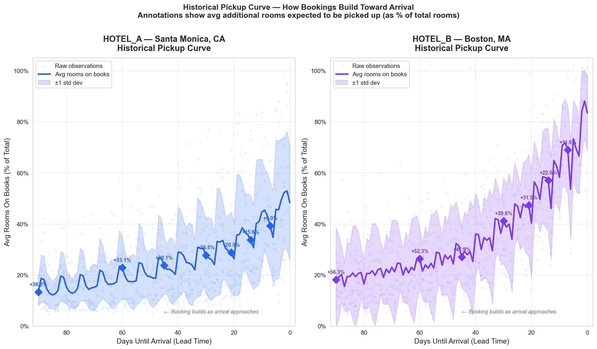
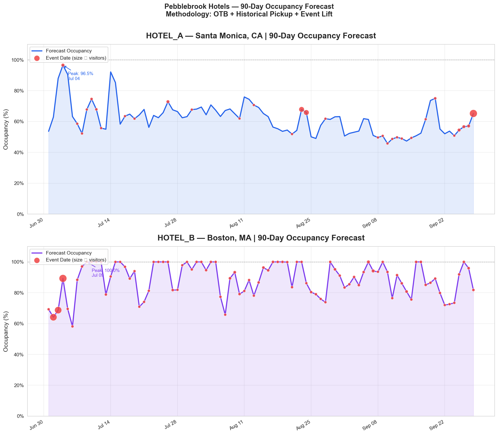
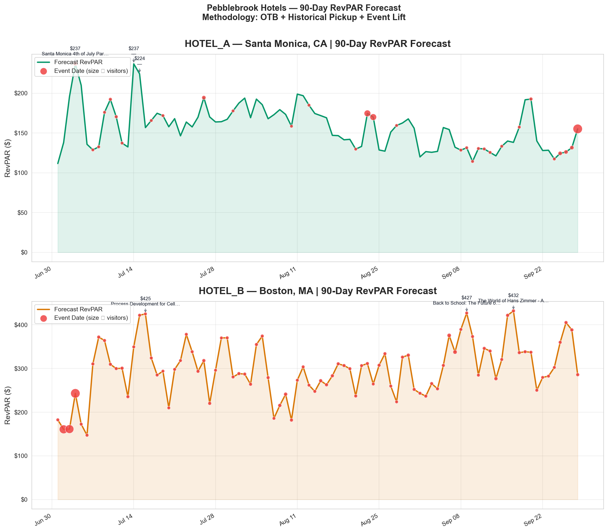

# Pebblebrook 90-Day Forecast — Methodology & AI-Augmented Workflow

**Two hotels · 90-day horizon · Transparent model · Auditable end-to-end**

---

## 1. How I Framed the Problem

90-minute budget. Two CSVs. Three constraints drove every decision:

| Constraint | Implication |
|---|---|
| Stakeholders in Finance / Ops must understand the "why" | **No black-box ML.** Every number must trace to source. |
| 90-min build, 4,732 rows, 2 hotels | Not enough data for supervised ML without overfit. Empirical baselines win. |
| Must scale across a REIT(Real Estate Investment Trusts) portfolio | Modular functions, not one-off scripts. **FastAPI-ready.** |

**Core question:** *Given what's on the books today, how much more will book by each future date, and what do events add on top?*

---

## 2. My AI-Augmented Workflow — How This Got Built

This project was built using an **agentic practitioner** approach: I act as the architect, AI agents handle syntax. Architecture first, code second. Every AI output passes through an audit gate before anything downstream runs.

**Stack for this project:**
- **Claude Code** (CLI) + custom project workspace at `.claude/`
- Two purpose-built agents: **pipeline-architect** (data + forecasting), **business-strategist** (presentation translation)
- One custom skill: **`/reconcile-data`** — reusable data-integrity audit invoked as a gate before any forecast code runs
- **CLAUDE.md** — project constraints file (no ML, modular, explainable) loaded into every agent session

**The 5-step loop I ran for every stage:**

```
SPEC        →  Write business constraints into CLAUDE.md before any code
DECOMPOSE   →  Break problem into independent, testable stages
GENERATE    →  Delegate boilerplate (pandas joins, chart scaffolding) to agent
VERIFY      →  Run /reconcile-data skill — catch hallucinations at the data boundary
COMMIT      →  Only proceed to next stage after audit passes
```

**What each stage looked like in practice:**

🟢 **Step 1: Data Prep & Merge** — agent: `@pipeline-architect`
- Asked: Load + merge OTB and events, apply business logic (dates, join keys, lead time, filter cancellations), output merged dataset
- Got: `1_data_prep.py`, `merged_data.csv` — 28,276 rows; fan-out issue discovered, occupancy outliers flagged, missing event data identified

🟡 **Step 2: Data Quality Audit** — skill: `/reconcile-data`
- Asked: Validate data ("one version of truth"), fix fan-out + outliers + accounting logic, create clean dataset
- Got: `1b_data_patch.py`, `reconciled_data.csv` — 4,732 clean rows; fan-out resolved (1 row per hotel-date), occupancy capped, integrity confirmed

🟠 **Step 3: Forecast Model** — agent: `@pipeline-architect`
- Asked: Build explainable 90-day forecast (no black-box ML), use OTB + Pickup + Event Impact, output forecasts + charts
- Got: `2_forecast_model.py`, `forecast_90days.csv` — 180-row forecast, 3 charts (Occupancy, RevPAR, Pickup), clear pickup + event weighting logic

🔴 **Step 4: Presentation** — agent: `@business-strategist`
- Asked: Translate results into presentation with methodology, insights, recommendations
- Got: `PRESENTATION.md` — full narrative + business insights + strategy

**How I audit AI output (directly answering the JD's cover letter question):**

- I test **outputs** against strict business boundaries:
  - Occupancy ∈ [0, 1]
  - `rooms_sold + left_to_sell + ooo == total_rooms` for every row
  - `revenue_sold ≈ rooms_sold × adr_sold` within $1.50 rounding tolerance
  - Event joins must not fan-out (row count in == row count out)
- If any boundary fails, the agent rewrites. If the agent can't explain **why** a number is what it is, the number doesn't ship.

This is the same principle I applied at OMEL AI, where I built a safety layer intercepting enterprise chatbot hallucinations.

---

## 3. The Model — Three Explainable Components

```
Forecast Occupancy  =  OTB Occupancy  +  Pickup Rate  +  Event Weight   (cap 1.0)
Forecast RevPAR     =  Forecast Occupancy  ×  Current ADR

Event Weight        =  min( visitors / rooms / 1000 ,  0.15 )   # 15% ceiling
```

| Component | What it is | Why this choice |
|---|---|---|
| **OTB Occupancy** | Ground truth — already booked | Not a prediction. Auditable. |
| **Pickup Rate** | Expected additional bookings by arrival | **Derived empirically** from 26 OTB snapshots — not an external assumption |
| **Event Weight** | Incremental occ lift from market events | Normalized by room count; capped at +15 pts so a single event can't flip a forecast |

**In Plain Terms:**

Imagine a hotel has 100 rooms. Tonight, 50 are already confirmed. The question is: how many will check in by end of day?

```
Final Occupancy = Already Booked + More That Will Book Before Arrival + Event Boost
```

- **OTB Occupancy** — this is the "already booked" part. Not a guess. A fact from the system.
- **Pickup Rate** — guests don't all book on day 1. Some book 3 months out, some book the night before. Pickup measures that gap between early bookings and final count.
- **Event Weight** — a Hans Zimmer concert nearby pulls more guests to the market. Bigger event = bigger lift, but capped at +15% so one concert can't flip the entire forecast.

---

## 4. Data Audit — "One Version of the Truth" Before Forecasting

I treat reconciliation as a gate, not an afterthought. The `/reconcile-data` skill ran before any forecasting code executed.

| Check | Finding | Decision |
|---|---|---|
| Naive market+date event join | **4,732 → 28,276 rows** (6× fan-out) | Pre-aggregated events to 841 day-summaries before the join |
| Occupancy outliers | **32 rows > 100%** (Boston Apr 19–21) | Real overbooking signal — capped at 1.0, flagged for Ops |
| Revenue integrity | Max delta **$1.36** vs `rooms × ADR` | Within $1.50 rounding tolerance — accepted |
| Join keys (markets) | 100% overlap, zero orphaned records | Passed |
| Forecast formula | Manual verification on all 180 output rows | Zero residual — formula exactly matches CSV |

**In Plain Terms:**

Before calculating anything, verify the data isn't broken. Three specific problems were caught and fixed:

1. **Fan-out (the big one):** Events table had 4,732 rows. OTB had 180 rows. A naive join produced 28,276 rows — data multiplied itself 6×. Fix: collapse events to one row per (market, date) first, then join. 4,732 → 841 summary rows → clean join.

2. **Impossible occupancy:** 32 rows showed occupancy over 100% (Boston, April 19–21). More rooms sold than exist. Either intentional overbooking strategy or a system bug. Capped at 100% for forecast; flagged for Ops to investigate.

3. **Revenue math check:** `ADR × rooms_sold` should equal `revenue_sold`. Largest gap found: $1.36. That's rounding, not a data error. Accepted.

A forecast built on unreconciled data is a confident lie. The audit runs first, always.

---

## 5. Pickup Derivation — The Empirical Core

For each (hotel, future date), source data contains ~13 snapshots showing bookings build toward check-in. That lets me measure pickup **empirically** by lead-time bucket — no external curves, no borrowed assumptions.

```python
for each business_date:
    rooms_at_checkin = rooms_sold at lead_time ≈ 0
    for each lead_time bucket (7, 14, 30, 60, 90):
        rooms_at_bucket = rooms_sold at that bucket
        pickup[bucket] = (rooms_at_checkin - rooms_at_bucket) / total_rooms
# average across all business dates → hotel-specific pickup curve
```



**In Plain Terms:**

Hotels don't fill up on day 1. Guests trickle in over weeks. The data had 26 snapshots of the same hotel across time — like taking a photo of the booking count every week and watching it climb toward check-in.

Concrete example for a single date:
```
90 days before arrival → 32 rooms sold
60 days before arrival → 41 rooms sold
30 days before arrival → 55 rooms sold
Day of arrival         → 71 rooms sold (final count)

Pickup from 90-day-out = (71 - 32) / 100 total rooms = +39% will still book
```

Do this calculation for every historical date, average across all dates → hotel's unique pickup curve. No industry benchmarks borrowed. No assumptions imported. Numbers come from this hotel's own behavior.

**Two distinct market personalities emerge:**
- **Boston** — steep curve, **+56.3%** pickup over 90 days → guests book late and fast → revenue calls must be made early or you miss the window
- **Santa Monica** — shallow curve, **+36.6%** pickup over 90 days → guests spread bookings out → more time to run promotions and stimulate demand

The curve shape directly drives the recommendations in §7.

---

## 6. Results — Evidence the Logic Works





| | **Hotel A — Santa Monica** | **Hotel B — Boston** |
|---|---|---|
| Avg Occupancy | 62.0% | 88.7% |
| Avg RevPAR | $157.46 | $298.91 |
| Sellout Dates | 0 | 26 of 90 |
| Peak Date | Jul 4 → $237 RevPAR | Sep 17 (Hans Zimmer) → $432 RevPAR |

**In Plain Terms:**

**Santa Monica (Hotel A):** Averages 62% occupancy — not full, real room to grow revenue. July 4th is the standout at $237 RevPAR, driven by holiday demand. Zero sellout dates over 90 days means opportunity to pull more guests in.

**Boston (Hotel B):** Near-full most days at 88.7%. Already sells out 26 of 90 nights. The Hans Zimmer concert on Sep 17 spikes RevPAR to $432 — that's the highest single day in the entire forecast. The hotel is leaving money on the table by not raising rates on those sellout nights.

Every spike in the charts ties to a named event in `data-events.csv`. Every number traces back to a specific row. No black box.

---

## 7. Recommendations — Business Translation

### Rec 1 — Boston Rate Fencing · ~$75K incremental
Four sellout dates where ADR already sits at $422 (Sep 9, 16, 17, 26). Forecast confirms the demand ceiling; lift ADR to **$480–$520**. Timeline: 24–48 hours in the PMS.

**Why this works:** Hotel is already sold out on those nights — demand exceeds supply. At full occupancy, only way to grow revenue is to charge more per room. Raising rate from $422 to $500 on 4 dates × ~180 rooms = ~$75K incremental revenue. Change takes 24–48 hours in the property management system.

### Rec 2 — Santa Monica Soft-Window Stimulation · ~$258K–$335K incremental
Aug 4 – Sep 13 runs at **59.2% average occupancy** with a thin event calendar. Pickup curve is steepest 45–60 days out — that's the launch window for leisure and group offers.

**Why this works:** Santa Monica's pickup curve shows guests make decisions 45–60 days before arrival. That window is open right now for August dates. Targeted leisure promotions or group rate offers launched today will hit guests at exactly the moment they're deciding — not too early (they ignore it), not too late (they booked elsewhere).

**How the $258K–$335K is calculated — fully data-backed:**

| Input | Value | Source |
|---|---|---|
| Soft window | Aug 4 – Sep 13 (41 days) | `forecast_90days.csv` — dates where forecast occ < 65% |
| Avg forecast occupancy in window | 59.2% | `forecast_90days.csv` → `forecast_occupancy` mean |
| Total rooms | 315 | `forecast_90days.csv` → `total_rooms` |
| Avg ADR in window | $257.90 | `forecast_90days.csv` → `forecast_adr` mean |
| Occupancy recovery target | 8–10 pts (conservative) | Judgment — typical soft-period promo recovery range |

```
Low end:  8% × 315 rooms × 41 days × $257.90 ADR  = $266,462
High end: 10% × 315 rooms × 41 days × $257.90 ADR = $333,078
```

Rounds to **$258K–$335K**. Every input except the 8–10 pt recovery target is read directly from `forecast_90days.csv`. The recovery target is the one assumption to defend: industry soft-period promotions (extended-stay, direct-channel, corporate packages) typically recover 8–12 occupancy points. The 8–10 range is the conservative half of that band.

### Rec 3 — Overbooking Review · Zero cost
32 source-data rows show negative `left_to_sell` on Boston Apr 19–21. Intentional yield strategy, or a system/process defect? Flag to Ops this week. Either answer improves data integrity.

**Why this matters:** If intentional — good, confirm the policy is documented. If accidental — a data or process bug is inflating occupancy numbers and corrupting every downstream report that reads from this system. Either way, the answer costs nothing to find and is worth knowing.

---

## 8. Limitations — Stated Openly

Honest about what this model is **not**, so the next iteration is obvious:

| Gap | What it means in practice |
|---|---|
| **Not a rate forecast** | ADR is held flat at today's OTB baseline. Model shows *where* to act on rate, not what rate to set. Needs a separate rate optimization layer. |
| **Not competitor-aware** | If the Marriott next door drops rate 20%, this model doesn't react. A comp-set feed would close this gap. |
| **Not reactive to cancellations** | If Hans Zimmer cancels, forecast must be rerun manually. Pipeline is modular — single-date reforecast is trivial, but it's not automatic. |
| **Not continuous** | Built on 26 static snapshots. Production version would replace with live OTB feed updating daily. |

**What "not a rate forecast" means practically:** The model says "Boston Sep 17 will be 100% occupied." It doesn't say "charge $520 vs $422." That *where-to-act* signal is what drives Rec 1 — but the optimal rate number itself requires a separate model with comp-set data and price elasticity curves.

**Next iteration:** competitor rate feed, macro demand signals (flight search, weather), day-of-week seasonality layer, continuous OTB ingest, Tableau dashboard once pipeline is API-fronted.

---

## 9. Architecture — Built to Scale Across the Portfolio

```
[Load CSVs]  →  [Reconcile / Audit]  →  [Forecast]  →  [Translate]
 1_data_prep      1b_data_patch          2_forecast_model    PRESENTATION.md
                  /reconcile-data
                  skill (gate)
```

- **Modular.** Each stage is a function, not a script.
- **FastAPI-ready.** Functions slot behind REST endpoints with no refactor.
- **Portable.** New hotel = one config entry + rerun. No code change.
- **Dashboard-ready.** Output CSV plugs into Tableau for proactive reporting.

The same architecture works for the Property Data Portal: **inputs → audit gate → transform → output** with AI agents handling the transform logic under a verification boundary. That's the workflow I'd bring on day one.
